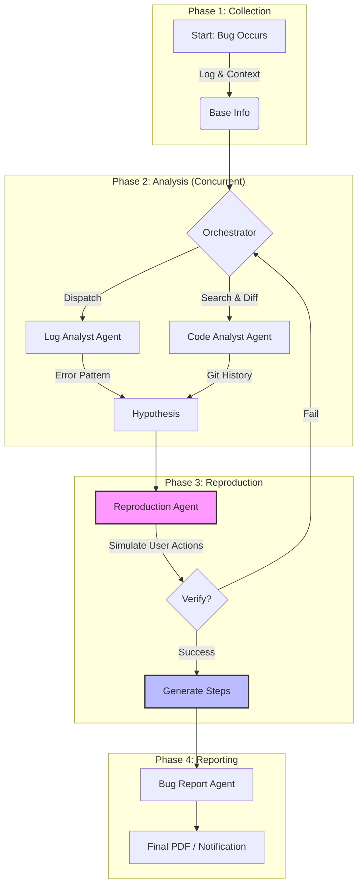

# BugSleuth: Automated Bug Analysis Agent

**BugSleuth** is an intelligent agent framework designed to automate the process of analyzing, reproducing, and reporting software bugs. It leverages LLMs to investigate issues, parsing logs, and identifying root causes.

## Features

*   **Automated Log Analysis**: Parses application logs to identify error patterns.
*   **Reproduction Steps**: attempts to deduce the steps required to reproduce a reported bug.
*   **Integrated Reporting**: Generates detailed bug reports with findings.
*   **Extensible Framework**: Designed to be integrated into custom toolchains.

## The BugSleuth Pipeline

The core value of BugSleuth is its ability to autonomously **deduce reproduction steps** from complex, noisy production environments. It transforms raw chaos into actionable reports via a structured 4-stage pipeline:



1.  **Collection**: Captures logs, screenshots, and device state.
2.  **Analysis**: Concurrently analyzes logs for error patterns and code for recent changes (Git history/Diffs) to form a hypothesis.
3.  **Reproduction (Core)**: The system attempts to simulate user actions based on the hypothesis to verify the bug. **Finding the exact reproduction steps is the key deliverable.**
4.  **Reporting**: Synthesizes all findings into a clear, actionable report for developers.

## BugSleuth 流水线 (The Pipeline)

BugSleuth 的核心价值在于它能够从复杂、嘈杂的生产环境中**自主推导复现步骤**。它通过一个结构化的 4 阶段流水线，将原始的混沌转化为可执行的报告：

```mermaid
graph TD
    subgraph "阶段 1: 信息收集 (Collection)"
        A[开始: Bug 发生] -->|日志 & 上下文| B(基础信息)
    end
    
    subgraph "阶段 2: 分析 (Analysis)"
        B --> C{中控 (Orchestrator)}
        C -->|派发| D[日志分析 Agent]
        C -->|搜索 & 比对| E[代码分析 Agent]
        D -->|错误模式| F[形成假设]
        E -->|Git 变更| F
    end
    
    subgraph "阶段 3: 复现 (Reproduction)"
        F --> G[复现 Agent]
        G -->|模拟用户操作| H{验证成功?}
        H -->|是| I[生成步骤]
        H -->|否| C
    end
    
    subgraph "阶段 4: 报告 (Reporting)"
        I --> J[报告生成 Agent]
        J --> K[最终 PDF / 通知]
    end
    
    style G fill:#f9f,stroke:#333,stroke-width:2px
    style I fill:#bbf,stroke:#333,stroke-width:2px
```

1.  **收集 (Collection)**: 捕获日志、截图和设备状态。
2.  **分析 (Analysis)**: 并发分析日志中的错误模式，并检查代码的近期变更（Git 历史/Diff），从而形成假设。
3.  **复现 (Reproduction 核心)**: 系统尝试基于假设模拟用户操作来验证 Bug。**找到精确的复现步骤是核心交付物。**
4.  **报告 (Reporting)**: 将所有发现汇总为清晰、可执行的报告给开发人员。

## Installation

```bash
pip install -e .
```

## Getting Started

1.  **Environment Setup**:
    Ensure you have your target project's root directory accessible.

2.  **Run the Server**:
    ```bash
    bug-sleuth-server
    ```

## Contributing

This project is open source. Contributions are welcome!
